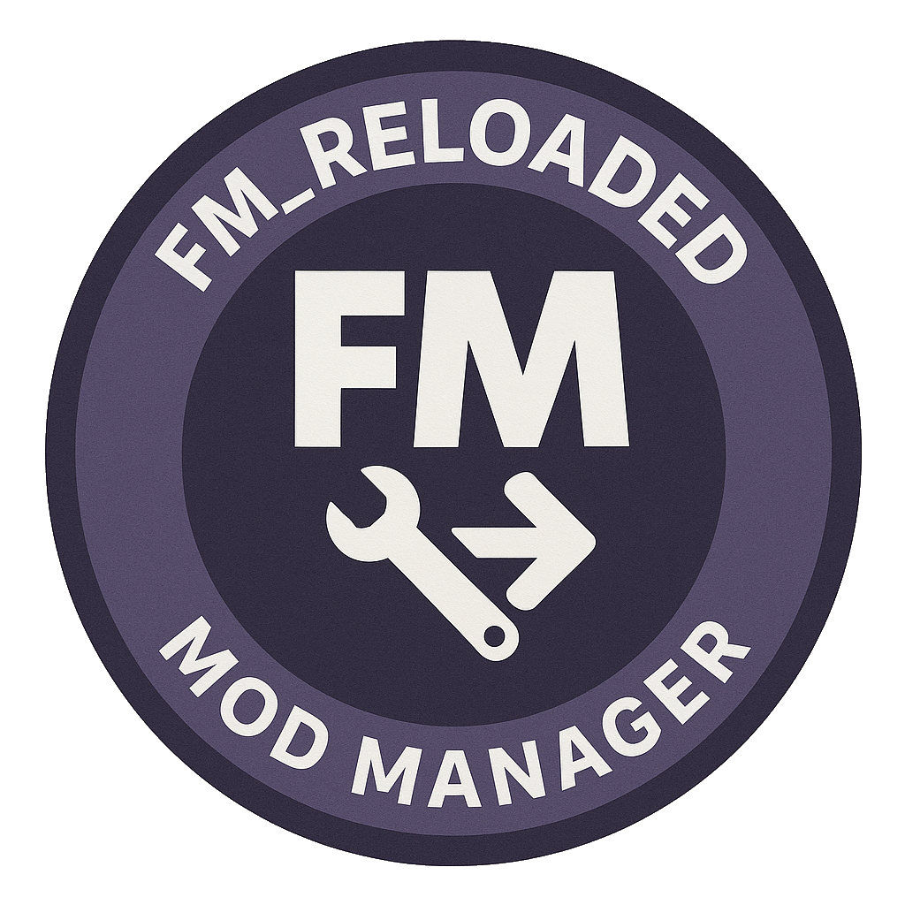
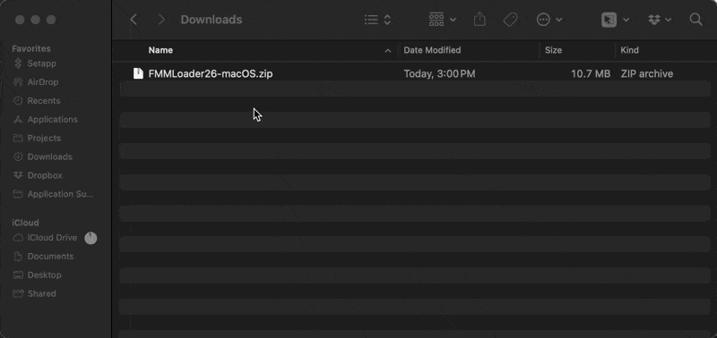
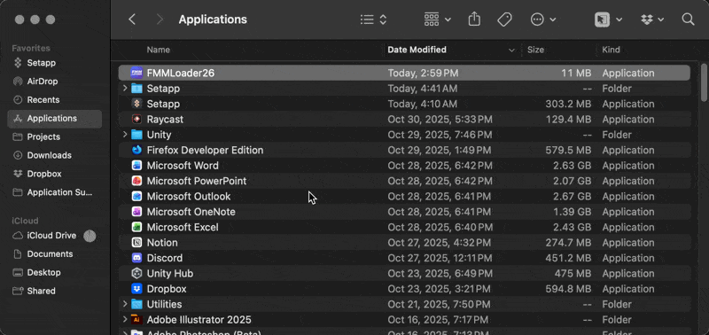
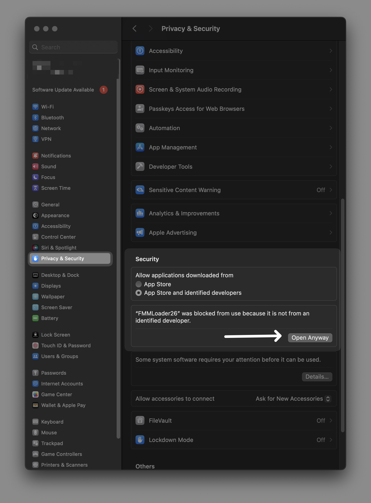

<p align="center">
  
</p>
<div align="center">
<h1>FM Reloaded Mod Manager</h1>

<a href="https://creativecommons.org/licenses/by-sa/4.0/"></a>


</div>

<p align="center">
  <a href="https://github.com/jo13310/FM_Reloaded/wiki">Wiki</a> •
  <a href="https://github.com/jo13310/FM_Reloaded/releases/latest">Download Latest Release</a> • <a href="#installation">Installation</a> •
  <a href="#features">Features</a> •
  <a href="#usage-guide">Usage Guide</a> •
  <a href="#credits">Credits</a> •
  <a href="modders.md">Modders Info</a>
</p>

**A cross-platform mod manager** for *Football Manager 2026*, enhanced with mod store, BepInEx support, and Discord integration.

**Originally developed by** [Justin Levine](https://justinlevine.me) / notJalco and presented with [FM Match Lab](https://fmmatchlab.co.uk/)
**Enhanced by GerKo** with mod store browser, BepInEx management, Discord integration, and auto-update features
___

## Installation

<details>
<summary>🍏 Mac Installation</summary>

### Installation on a Mac

1. Download **`FM_Reloaded.zip`** from [Releases](../../releases).
2. Unzip the compressed file, then drag to your `Applications` folder

<p align="center">
  
</p>
3. After moving the app to your apps folder (or folder of your choice), you can Control Click + Open to bypass Gatekeeper. You may still get a security pop up. _If you do not, skip the next section about bypassing gatekeeper_
<p align="center">
  
</p>
<h4>Bypassing Gatekeeper</h4>
Bypassing Gatekeeper is easy by visiting System Preferences →  Privacy & Security. You then can click "Open Anyway"
<p align="center">
  
</p>
After clicking "Open Anyway" you will likely recieve a popup. You can press "Open" again on that popup, and the app should open.<br><br>
</details>
<details>
<summary>🖥️ Windows Installation</summary>

### Installation on Windows

1. Download **`FM_Reloaded.exe`** from [Releases](../../releases).
2. Run it directly as Administrator — no installation required. You may get a popup for Windows Defender, click "More Info" and "Run Anyway"

</details>

---

## Features

### Core Features
- ✅ **Cross-platform GUI** (Windows & macOS)
- ✅ **Automatic FM folder detection**
- ✅ **Drag & drop import** of .zip or folder-based mods
- ✅ **Enable / Disable mods** with one click
- ✅ **Load order control** (last-write-wins system)
- ✅ **Conflict Manager** — detects overlapping files before applying
- ✅ **Restore points & one-click rollback**
- ✅ **Type-aware installs**:
  - Bundles → Game data folder
  - Tactics → Documents/Sports Interactive/FM26/tactics
  - Graphics → Documents/Sports Interactive/FM26/graphics
- ✅ **Detailed logs** stored per run
- ✅ **No install required** — standalone executable

### Enhanced Features (v0.5.0)
- 🌐 **Mod Store Browser** — Browse and install mods from trusted repository
- 🔄 **Automatic Update Checking** — See when mods have updates available
- ⚙️ **BepInEx Manager** — One-click installation and configuration
- 💬 **Discord Integration** — Report bugs and submit mods via webhooks
- 📝 **Mod Template Generator** — Create properly formatted mod templates
- 🔔 **App Auto-Update** — Check for new app versions automatically
- ⚡ **Tabbed Interface** — My Mods, Mod Store, and BepInEx tabs
- 📊 **Smart Version Comparison** — Semantic versioning tracking

___

## Usage Guide

### 1 - Detect or Set Your Target Folder

- Click **Detect** — the app finds your FM data folder automatically.
- If that fails, click **Set…** and choose it manually:

**macOS (Steam):**

```bash
~/Library/Application Support/Steam/steamapps/common/Football Manager 26/fm.app/Contents/Resources/Data/StreamingAssets/aa/StandaloneOSX
````

**Windows (Steam):**

```bash
C:\Program Files (x86)\Steam\steamapps\common\Football Manager 26\fm_Data\StreamingAssets\aa\StandaloneWindows64
```

---

### 2 - Import a Mod

#### From File:
- Drag a `.zip` file or folder directly into the app window,
  **or** click **Import Mod…** and choose your file.

#### From Mod Store:
- Open the **Mod Store** tab
- Browse or search for mods
- Click on a mod to see details
- Click **Install Selected** to download and install

---

### 3 - Enable / Disable

- Select a mod and click **Enable (mark)** or **Disable (unmark)**.
- Enabled mods show **`yes`** in the "Enabled" column.

---

### 4 - Adjust Load Order

- Select a mod and use **Up (Order)** or **Down (Order)**.
- The **last mod in the list wins** if multiple mods modify the same file.

---

### 5 - Apply Mods

- Click **Apply Order** to write changes to the FM folder.
- You'll get a warning if:
  - Football Manager is running
  - There are file conflicts between mods

> [!WARNING]
> You may need to allow **FM Reloaded** "App Management" permissions under
> `System Preferences → Privacy & Security → App Management` (macOS).

---

### 6 - BepInEx Installation

1. Open the **BepInEx** tab
2. Click **Install BepInEx**
3. Configure console logging (disabled by default)
4. View logs or edit config as needed

---

### 7 - Check for Updates

- Mods with updates show **⬆** in the Update column
- Go to **Help** → **Check for Updates…** to check for app updates
- Auto-check on startup can be configured in Settings

---

### 8 - Rollback

- Use **Rollback…** to restore a previous backup.
  (A backup is created automatically before each Apply.)

---

### 9 - Open Folders / Logs

- **Open Mods Folder** — view your installed mods
- **Open Logs Folder** — view detailed logs for each run
- **Copy Log Path** — copy the current log's file path to your clipboard

---

## Mod Store

The **Mod Store** provides access to a curated, trusted repository of mods:

- Browse all available mods
- Search by name, author, or type
- View mod details (description, version, author)
- One-click installation
- Automatic update notifications

To configure a custom store URL, go to **Settings** → **Preferences…**

For modders: See [STORE_SUBMISSION.md](../../STORE_SUBMISSION.md) for submission guidelines.

---

## BepInEx Support

BepInEx is a plugin framework for Unity games like Football Manager:

- **One-click installation** from the BepInEx tab
- **Console toggle** — enable/disable debug console
- **Config editor** — directly edit BepInEx.cfg
- **Log viewer** — check for errors and warnings

> [!NOTE]
> Console logging is disabled by default for cleaner gameplay.

---

## Discord Integration

### Report Bugs
1. Click **Report Bug** in the footer
2. Describe the issue and optionally provide your email
3. Logs are automatically attached

### Submit Mods
1. Click **Submit Mod** in the footer
2. Enter your mod's GitHub repository URL
3. Fill in mod details
4. The maintainer will review and add it to the store

Discord webhooks can be configured in **Settings** → **Preferences…**

---

## Credits

### Original Project
**FM_Reloaded_26** (formerly FMMLoader-26) was originally created by:
- **[Justin Levine](https://justinlevine.me)** ([@notJalco](https://github.com/justinlevinedotme)) - Original creator
- **[FM Match Lab](https://fmmatchlab.co.uk/)** - Support and presentation

### Enhanced Version
**Enhanced by GerKo** ([@jo13310](https://github.com/jo13310)) with:
- Mod Store integration and trusted repository
- BepInEx installation and management
- Discord webhook integration (bug reports & mod submissions)
- App auto-update checking
- Mod template generator
- Tabbed UI redesign
- Settings dialog and configuration
- Smart version comparison and update notifications

### Example Mod Contributors
- **knap** - Beta Tactics example
- **bassyboy** - UI Speedster example

---

## License

This project is licensed under the
**Creative Commons Attribution-ShareAlike 4.0 International License**.

<p align="left"> <a href="https://creativecommons.org/licenses/by-sa/4.0/">  </a> </p>

**Note:** License changed from CC BY-NC-SA 4.0 to CC BY-SA 4.0 (allows commercial use with attribution).

___

## Modders Info

Modders can visit [modders.md](modders.md) for more information on how to properly package their mods for FM Reloaded.

**Example mods are contained in the `example mods` directory of this repository. Thank you to knap and bassyboy for allowing their inclusion.**

For submitting to the store, see [STORE_SUBMISSION.md](../../STORE_SUBMISSION.md)
___

## Contributing

Contributors can visit [CONTRIBUTING.md](CONTRIBUTING.md) for information on contributing to this project.
___

## Other Important Notes

>[!CAUTION]
> This application involves modifying your FM game files. Some mods work, some mods don't. It is not a substitute or plug-and-play solution. It simply makes the distribution and installation of mods simpler. You should know how to verify your game files, and undo any changes if need be.

___

<p align="center">
  <em>Made with ❤️ for the Football Manager community</em>
</p>
